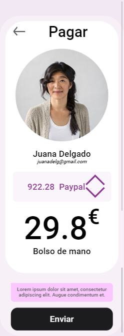

WEB
========
<a href="https://sosan.github.io/examen_toni/index.html">Web con Github Page</a> 
<a href="https://elastic-ritchie-845907.netlify.app/">Web con Netlify</a> 

# EXAMEN Toni
##### Principio del examen, para practicar

~~~
Primero hacer la rama para seguir y terminar el examen.

También esta el código de:
<picture> y <form>
~~~

> Este contenido se ha creado para mís alumnos, que se inician en el maravilloso mundo de la programación.

---
###### _Copyright 2020 - Toni Ferra_

